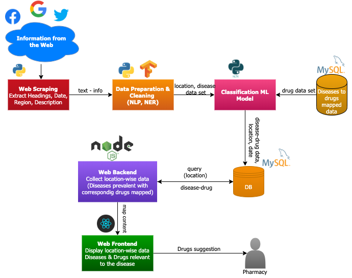

# Well Pharma #

**Team Members**
1) Alaukika Diwanji
2) Dhruwaksh Dave
3) Panth Desai
4) Udit Marolia

### Abstract ###
 
Many valuable information regarding the public health and welfare, disease outbreaks and their trend are available in the form of unstructured data lying in different news portals, Facebook, Twitter. It becomes important to become aware of the current diseases and to filter out relevant and correct information. This is especially important for commercial pharmacies as their need to be updated with the current outbreak in their region and also be ready stock-wise for the drugs needed to treat them. Our objective with Well-Pharma is to address this problem and built a system for the pharmacies which will analyse the disease outbreaks in all regions and carry out a disease-to-drug mapping and alert the pharmacist so as to keep the stock ready.

WellPharma will be a Web Application - built as an automated system for querying filtering and visualising the disease outbreak and to stock their respective drugs.

### Target User ###

The main target user for the application will be the commercial pharmacies. The system will provide insights to the pharmacists on which drugs need to be stocked as per the current disease outbreak. 

### Process Flow ###

The main objective of the system will be to gather information regarding the disease outbreaks, location-wise through web crawling the public websites such as Twitter, Facebook and new articles on Google. This information will then be cleaned and will be classified location-wise,uisng NLP and NER. The system will also maintain the data for disease to drug mapping. This data will be mapped with the location-wise diseases. The user(pharmacist) requests states his location, based on which the system provides the diseases prevalent in the region and the drugs corresponding to them. The data can help identify which drugs are needed to be stocked such that there is no shortage.

### Technology Stack ###

**Web Application**

The Web Application will be the main interface to the users. The application will be built using the JS tools 

**Frontend:** ReactJS will be used for the GUI.It will also take care of the authentication and token passing.

**Backend:** NodeJS  and NPM Libraries will be used for backend. It will communicate with MySQL database to fetch the queried. Data

**Cloud:** The web application will be hosted on Amazon AWS using Docker container

**Database**

MySQL database will be used to store all data, which is :
  a) The data from the classification model, which will give information about location wise disease outbreak
  b) The disease to drug mapped data
  c) The web application data

**Data Model**

**Data Cleaning and preprocessing:** Python will be used to extract the data from various public web sources and clean the data.

**NLP /NER:** Python,NLTK, Tensorflow will be used for classification of the data location wise so as the location and the diseases prevalent there are identified and mapped.

### Initial Feedback ###

Professor Ranjan's initial feedback
> You must clearly define the personas. If this is for the health care provider or govt agency then gathering drug sale data from all pharmacy in a zipcode(for ex) is tricky. sales data of drugs at local level may not be available publicly. They wont share. large pharma companies may share their sales data but that may not tell you the ground truth. Also in developing countries like india majority of drug sales are not tracked due to tax evasion. Here is the twist to the problem I am giving you. You apply NLP and NER on all the public news in a geography or zipcode to figure out the health related problems and then give recommnedation to local pharmacist to stock those OTC drugs. You can also extend this to beauty products based on the beauty trends but beauty trends are more global than local. Weather data can play role as well. 
